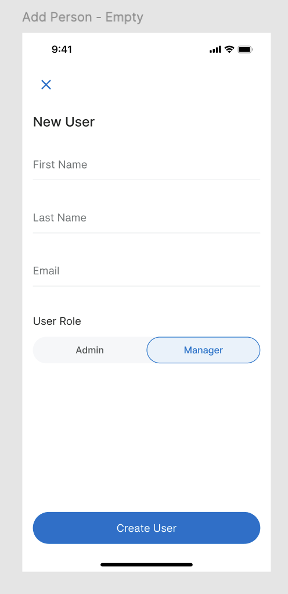

# Zeller React Native Code Challenge

## 1. Objective  
Build a **React Native application** that displays, filters, and manages a list of users.  
The app should integrate with the provided **GraphQL API** and persist data in a **local database** for offline usage.  

We will evaluate your submission based on:  
- **Code structure and maintainability**  
- **TypeScript usage**  
- **Testing approach and coverage**  

---

## 2. Requirements  

### **Data Integration**
- Fetch user data using the `listZellerCustomers` GraphQL query.  
  *(Schema and connection details are provided in `aws-exports.js` and `schema.gql`.)*  
- Store the fetched data in a local database such as **SQLite**, **WatermelonDB**, **Realm**, or similar.  
- Display the list of users from the **local database**, not directly from the network.  

### **User Management**
- Add new users and save them to the local database. *(No API mutation is required.)*  
- Update and delete users from the local database.  
- **Add validation to the form**:  
  - Name should not be empty.
  - Name cannot contain special characters (only alphabets and spaces allowed). 
  - Name must not exceed **50 characters**. 
  - Email (if included) must be in valid format.  

### **Filtering & Searching**
- Filter users by **user type** (`Admin`, `Manager`).  
- Implement a text search to filter users by **name**.  

### **UI & Interaction**
- Implement **pull-to-refresh** on the user list.  
- Use **Pager View** (or equivalent) so that the user can swipe between **Admin** and **Manager** lists.  
- Add **smooth animation for tab changes** (All ↔ Admin ↔ Manager) when swiping between views.  
- A reference file `tab-animation.mp4` is included in the repository.  
- Ensure the app runs on **iOS** and **Android**.  

### **Code Quality & Testing**
- Write **unit and/or integration tests** for critical parts of the application.  
- Follow **clean, readable, and consistent** coding practices.  

---

## 3. Design References  

**List Screen**  

  

**Create User Form**  

  

**📹 Tab Animation**  

  

---

## 4. Notes  
- You may use any state management solution (e.g., Redux, Zustand, Jotai, or Context API).  
- Keep the codebase modular and well-documented so it’s easy to review.  
- Aim for a production-quality implementation, even though this is a challenge.  
- Feel free to enhance the **user experience** with **smooth interactions** or **transitions** where appropriate.
- 💡 Consider using `react-native-pager-view` with animations to implement the Admin ↔ Manager swipe.  


---

## 5. Submission Guidelines  

1. Ensure your project includes:  
   - A clear **README** with setup and run instructions.  
   - Any necessary environment, keystore files or example configs (e.g., `.env.example`, `debug.keystore`).  
   - **Tests** and instructions on how to run them.  
2. Make sure your code runs without errors on a clean install using:  
   ```bash
   yarn install
   yarn ios   # or yarn android
   ```  
3. Once complete, **share the repository link** (or a zipped copy of your repo) with us.  
4. Do **not** include any dependencies or files that are not required for this project.  
